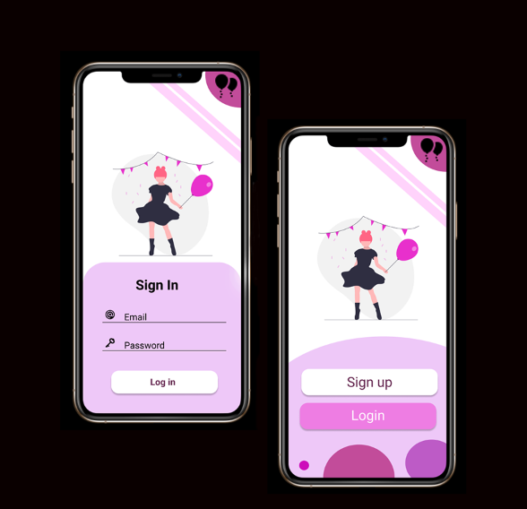

# FamParty

FamParty is an open source mobile application for personal event planing.🎉🎊

This application powered by ⚡Flutter⚡ dart framework

## Getting Started

1. Install Flutter

    Follow the official [guide](https://flutter.dev/docs/get-started/install) from the flutter team.

2. Run `flutter doctor`

    `flutter doctor`
    In here you can find whether all are okay

3. Go to the fam_party folder

    `cd fam_party/`

4.Install all the dependent flutter packages.

    `flutter pub get`

5.Run the application.

    `flutter run`

## Usable links

- [Prototype](https://www.figma.com/file/9eTvBSxX8FchJ9P7xvklTv/Fam-Party?node-id=0%3A1)

